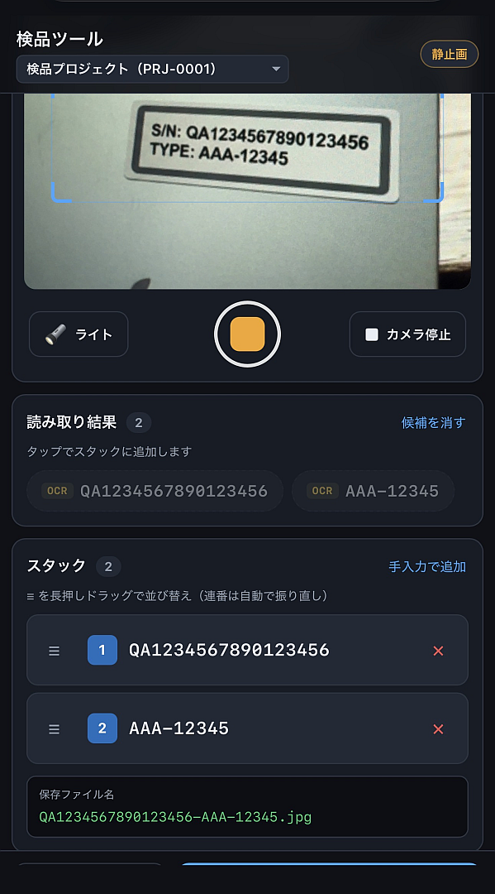

# 検品用Webアプリ（OCR付き）

スマートフォン（iPhone / Android）のブラウザで動く、OCR・バーコード・QR読み取り付きの検品・証跡保存用ツールです。

- フロント: HTML + JavaScript
- バックエンド: PHPの動くサーバ



---

## 1. ディレクトリ構成

```
serialnum-capture-php/
├── config/                 ★ 設定
│   ├── default.php           共通設定
│   ├── PRJ-0001.php          プロジェクト別の差分
│   ├── PRJ-0002.php          プロジェクト別の差分
│   └── loader.php            読み込みの仕組み（編集不要）
├── index.php               メイン画面
├── start-server.bat        開発用サーバー起動（Windows）
├── assets/
│   ├── css/style.css
│   ├── js/scanner.js       カメラ / OCR / バーコード・QR
│   ├── js/stack.js         スタックの保持・並び替え
│   ├── js/app.js           画面制御・送信
│   └── vendor/             （任意）ライブラリをローカルに置く場所
├── api/
│   ├── config.js.php       設定を画面側へ配信（編集不要）
│   └── upload.php          アップロード受け口
└── storage/                保存先（プロジェクトIDごとのフォルダが自動生成）
```

---

## 2. テスト起動

```powershell
# プロジェクトルートで
php -S 0.0.0.0:8080 -t .
```

または `start-server.bat` をダブルクリック。

- PC から: <http://localhost:8080/>
- スマホから: Cloudflare Tunnel 経由（次章参照）

---

## 3. 実機での動作確認 — Cloudflare Tunnel

`getUserMedia`（カメラ）は HTTPS または localhost でしか動きません。
`http://192.168.x.x:8080` に直接アクセスしてもカメラは起動しないため、
Cloudflare Tunnel で HTTPS 化して実機からアクセスします。

### 手順

```powershell
# 1) ローカルサーバーを起動（ターミナル1）
php -S 0.0.0.0:8080 -t .

# 2) トンネルを起動（ターミナル2）
cloudflared tunnel --url http://localhost:8080
```

起動すると次のような URL が表示されるので、これをスマホで開きます。

```
https://xxxx-xxxx-xxxx.trycloudflare.com
```

### cloudflared のインストール

```powershell
winget install --id Cloudflare.cloudflared
# または
scoop install cloudflared
```

### 注意点

- URL は起動のたびに変わります。固定URLが必要なら named tunnel を作成してください
  （`cloudflared tunnel login` → `cloudflared tunnel create <名前>` → DNS レコード紐付け）
- クイックトンネル（`--url`）は インターネットに公開されます。URL を知っていれば誰でもアクセスできるため、
  検証中だけ起動し、終わったら停止してください。
  常用する場合は named tunnel + Cloudflare Access で認証をかけることを推奨します
- `storage/` もトンネル越しに見えます
- 撮影画像が数百KB〜1MB程度あるため、回線が細いと送信に数秒かかります

### 本番運用

Apache / nginx / IIS 配下に置いて通常の HTTPS で公開するか、named tunnel を常時起動してください。
PHP built-in server は HTTPS 非対応・同時接続が弱いため、あくまで開発用です。

---

## 4. 使い方

1. **カメラ開始** を押してカメラを起動
2. 青いガイド枠に文字・バーコードを合わせる（枠の中だけを読み取ります）
3. 読み取れた文字列が「読み取り結果」に並ぶ
4. 使いたい文字列をタップして「スタック」に追加
5. スタックは `≡` をドラッグして並び替え可能
6. **シャッター**を押して静止画を確定（このとき静止画に対して OCR が1回走ります）
   - 静止画の状態でもう一度シャッターを押すとリアルタイムに戻り、撮り直せます
7. 必要なら備考(担当者名等)を入力
8. **送信** → `storage/<プロジェクトID>/<スタック文字列をハイフン連結>.jpg` として保存
9. **クリア** で備考以外を初期状態に戻す

送信ボタンは「スタックが1件以上」かつ「撮影済み」のときだけ有効になります。

---

## 5. 設定

設定はすべて `config/` にまとまっています。

```
config/default.php ─┐
config/<ID>.php ────┴→ ┬→ 画面側（api/config.js.php が JavaScript として配信）
                       └→ 保存側（api/upload.php が直接読み込み）
```

- **共通の設定** … `config/default.php`
- **プロジェクトごとに変えたい設定** … `config/<プロジェクトID>.php`（詳しくは次章）

### 主な設定項目

| 項目 | 説明 |
|---|---|
| `PROJECT_ID` | 送信時のプロジェクトID。保存フォルダ名になる |
| `PROJECT_LABEL` | 画面上部の表示名 |
| `API.UPLOAD_URL` | 送信先。既定は `./api/upload.php` |
| `CAMERA.FACING_MODE` | `environment`（背面）/ `user`（前面） |
| `ROI.*` | 読み取りガイド枠の位置・大きさ。枠を絞るほど高速・高精度。カメラ表示の縦横比（CSS の `.camera-stage`）を変えたら合わせて調整する |
| `OCR.ENABLED` | OCR の有効/無効 |
| `OCR.MODE` | `alnum`（数字+英大文字）/ `numeric`（数字のみ）/ `alnum_mixed` |
| `OCR.EXTRA_CHARS` | MODE に追加で許可する記号。既定 `'-'`（ハイフン）。例: `'-./'` |
| `OCR.INTERVAL_MS` | 認識間隔。端末が重いときは長くする |
| `OCR.MIN_CONFIDENCE` | 信頼度のしきい値。誤検出が多いなら上げる |
| `OCR.MIN_LENGTH` / `MAX_LENGTH` | 採用する文字数の範囲 |
| `OCR.STABLE_COUNT` | 同じ文字列が何回続けて読めたら採用するか。誤検出対策 |
| `OCR.PATTERN` | 追加の絞り込み正規表現。スラッシュで囲まない文字列で書きます。例: `'^\d{4}-\d{4}$'`。`null` で無効。**品番の形が複数あるときは配列で並べます**（例: `['^QA\d{16}$', '^[A-C]{3}-\d{5}$']`）。どれか1本に一致すれば採用 |
| `BARCODE.ENABLED` | 1次元バーコード読み取りの有効/無効 |
| `BARCODE.FORMATS` | CODE_128 / CODE_39 / EAN_13 など |
| `QR.ENABLED` | QRコード読み取りの有効/無効 |
| `CAPTURE.CROP_TO_VIEW` | `true`（既定）でカメラ読み取り部に写っている範囲だけを保存。`false` で映像全体 |
| `CAPTURE.MAX_EDGE` / `JPEG_QUALITY` | 送信する画像のサイズ・画質 |
| `UI.VIBRATE_MS` / `UI.BEEP` | 検出時のバイブ・ビープ |

#### `OCR.PATTERN` を複数登録する

品番の形が複数あるときは、**配列で1行ずつ並べてください**。

```php
'OCR' => [
    'PATTERN' => [
        '^QA\d{16}$',        // QA + 数字16桁
        '^[A-C]{3}-\d{5}$',  // A〜C の3文字 + ハイフン + 数字5桁
    ],
],
```

1本の式に `|` で詰め込むと事故ります。`|` は優先順位がいちばん低いため、

```
^QA\d{16}|[A-C]{3}-\d{5}$
```

は `(^QA\d{16})` または `([A-C]{3}-\d{5}$)` と解釈され、**それぞれ片側にしか
アンカーが掛かりません**。結果として `TYPEAAA-12345` のように前後にゴミが付いた
文字列まで通ってしまいます。配列なら各行が独立した式になるので、この事故は起きません。
| `DEBUG` | コンソールに詳細ログを出す |

### ファイル名の作り方: `FILENAME`

| 項目 | 説明 |
|---|---|
| `ALLOWED_CHARS` | ファイル名に使える文字。既定 `0-9A-Za-z._-`。これ以外は除去されます |
| `SEPARATOR` | スタック文字列をつなぐ区切り文字。既定 `-` |
| `MAX_LENGTH` | ファイル名の最大長。超過時は切り詰め + ハッシュ付与 |

### サーバー専用: `SERVER`

| 項目 | 説明 |
|---|---|
| `STORAGE_DIR` | 保存ルート |
| `ALLOWED_PROJECT_IDS` | 許可するプロジェクトID。空配列なら制限なし |
| `ON_CONFLICT` | 同名時の動作 `suffix`（`_2`,`_3`…） / `timestamp` / `overwrite` |
| `SAVE_META` | 備考などを `<画像名>.json` に保存するか |
| `MAX_IMAGE_BYTES` | 画像サイズ上限 |
| `MAX_STRINGS` / `MAX_STRING_LENGTH` | スタック文字列の件数・長さ上限 |

---

## 6. 複数プロジェクトを使い分ける

現場やラインごとに設定を変えたい場合は、`config/<プロジェクトID>.php` を作るだけです。

### 追加のしかた

`config/PRJ-0003.php` を作り、変えたい項目だけ書きます。

```php
<?php
return [
    'PROJECT_LABEL' => '第3ライン',

    'OCR' => [
        'MODE'    => 'numeric',      // このラインは数字だけ
        'PATTERN' => '^\d{8}$',      // 8桁固定
    ],
];
```

書かなかった項目は `config/default.php` の値がそのまま使われます。
これだけで `storage/PRJ-0003/` に保存されるようになります。

### 切り替え方

**URL で指定する**

```
https://xxxx.trycloudflare.com/?p=PRJ-0003
```

端末ごとに違うプロジェクトを使うなら、この URL をホーム画面に追加しておくのが確実です。

**画面で選ぶ**

プロジェクトが2つ以上あると、ヘッダーのプロジェクト名が自動的にセレクトに変わります。
選ぶとそのプロジェクトに切り替わります（設定を読み直すため画面が再読み込みされます。
スタックや撮影内容がある場合は確認が出ます）。

プロジェクトが1つだけのときはセレクトは出ず、これまでどおりのラベル表示です。

### 上書きのルール

| 書き方 | 動作 |
|---|---|
| `'OCR' => ['MODE' => 'numeric']` | `MODE` だけ上書き。`MIN_CONFIDENCE` などは default のまま |
| `'BARCODE' => ['FORMATS' => [...]]` | **配列は丸ごと置き換え**。一部だけ追加はできません |
| 項目を書かない | default の値をそのまま使う |

### 注意点

- プロジェクトIDは設定ファイル名と保存フォルダ名になります。使える文字は英数字と `. _ -` です
- `default` と `loader` はプロジェクトIDに使えません（仕組みのファイル名のため）
- 存在しないIDを指定しても既定プロジェクトで動きます（エラーにはなりません）。
- 特定のプロジェクトだけを許可したい場合は、`config/default.php` の
  `SERVER.ALLOWED_PROJECT_IDS` にIDを並べてください

---

## 7. OCR の精度を上げるコツ

- ガイド枠を対象の大きさに合わせる（`ROI.WIDTH` / `HEIGHT`）
- 対象を画面いっぱいに近づける。文字が小さいと読めません
- `OCR.MODE` を `numeric` にできる現場なら、そのほうが圧倒的に安定します
- 桁数が決まっているなら `OCR.MIN_LENGTH` / `MAX_LENGTH` / `PATTERN` を固定する
- 品番の形が2種類以上あるときは、`PATTERN` を**配列で並べる**（1本の式に `|` で詰め込まない。理由は下記）
- 誤検出が多い → `MIN_CONFIDENCE` と `STABLE_COUNT` を上げる
- 反応が遅い → `INTERVAL_MS` を上げる、`ROI` を小さくする

なお、バーコード/QR が使える現場なら OCR より圧倒的に速く確実です。
`BARCODE.ENABLED` / `QR.ENABLED` を活かしたうえで、OCR は補助として使う運用を推奨します。

---

## 8. OCRが読み取れないときの調べ方

URL の末尾に **`?debug=1`** を付けてアクセスすると、画面下部に「OCR診断」パネルが出ます。

```
https://xxxx.trycloudflare.com/?debug=1
```

パネルには OCRに実際に渡している画像そのものと、その認識結果が表示されます。

| パネルの状態 | 原因 | 対処 |
|---|---|---|
| 画像が真っ黒／目的の文字が写っていない | ガイド枠と実際の切り出し位置がずれている | `ROI` の値を調整。`ROI.ENABLED: false` にすると画面全体を読むので切り分けになる |
| 画像に文字は写っているが小さい | 文字の解像度不足 | 対象に近づく。`ROI` を小さくする。`OCR.TARGET_HEIGHT` を上げる |
| 「文字が1つも認識されていません」 | 文字が小さい／ぼけ／低コントラスト | 近づく、ライトを使う、`ROI` を絞る |
| `NG ... 信頼度42 <- 信頼度42` と出る | 信頼度のしきい値で落ちている | `OCR.MIN_CONFIDENCE` を下げる |
| `信頼度?` と表示される | 端末が信頼度を返していない（iPhoneで発生）。この場合は信頼度で落とさない仕様 | 対処不要 |
| `NG ... (短い)` | 文字数フィルタで落ちている | `OCR.MIN_LENGTH` を下げる |
| `NG ... (許可外文字)` | 英小文字などが混じっている | `OCR.MODE` を `alnum_mixed` にする |
| `NG ... (安定待ち)` | 連続一致の要求で落ちている | `OCR.STABLE_COUNT` を `1` にする |
| ヘッダーに「OCRエラー」と出る | OCR実行時に例外が発生 | トーストのメッセージとブラウザのコンソールを確認 |

### よくある原因

1. **文字が小さすぎる** — 最も多い原因です。OCR は文字の高さが 30px 程度ないと読めません。
   バーコードよりかなり近づく必要があります
2. **フィルタが厳しい** — `MIN_CONFIDENCE` / `STABLE_COUNT` を緩めると改善します
3. **ガイド枠から外れている** — 枠内に文字全体が入っている必要があります

### 切り分けのコツ

バーコード/QR は画面全体を走査しますが、OCR はガイド枠の中だけを見ます。
「バーコードは読めるのに文字だけ読めない」場合、まず `ROI.ENABLED: false` にして
画面全体をOCR対象にしてみてください。これで読めるなら枠の設定が原因です。

---

## 9. オフライン（CDNが使えない環境）で動かす

既定では以下を CDN から読み込んでいます。

- `tesseract.js@5.1.1`（OCR）
- `@zxing/library@0.21.3`（バーコード / QR）
- `tesseract.js-core@5.1.0`（wasm）
- `eng.traineddata`（学習データ・約12MB）

社内ネットワークで CDN が塞がれている場合は、次のようにローカル化してください。

1. 上記ファイルを `assets/vendor/` に配置
2. `index.html` の 2つの `<script src="...">` をローカルパスに変更
3. `config.php` の `OCR.WORKER_PATH` / `CORE_PATH` / `LANG_PATH` をローカルパスに変更
   （`LANG_PATH` は `eng.traineddata.gz` を置いたディレクトリを指定）

初回アクセス時に約 17MB のダウンロードが発生します。以降はブラウザキャッシュに乗りますが、
現場で使う前に一度 Wi-Fi 環境で読み込ませておくと安心です。

---

## 10. 保存されるもの

```
storage/
└── PRJ-0001/
    ├── AB123-CD456-EF789.jpg      撮影画像（スタック文字列をハイフン連結）
    └── AB123-CD456-EF789.json     備考などのメタ情報（SERVER.SAVE_META = true のとき）
```

`*.json` の中身:

```json
{
  "project_id": "PRJ-0001",
  "strings": ["AB123", "CD456", "EF789"],
  "note": "検品担当：山田",
  "image": "AB123-CD456-EF789.jpg",
  "created_at": "2026-09-09T10:39:00+09:00"
}
```

---

## 11. 未確定・今後の検討事項

- **備考欄の扱い**: 仕様未確定のため、暫定で `<画像名>.json` に保存しています。
  不要なら `config.php` の `SERVER.SAVE_META` を `false` にすれば JSON は作られません。
- **`storage/` の公開**: PHP built-in server ではブラウザから `storage/` が直接見えます。
  保存済み画像の確認には便利ですが、Cloudflare Tunnel を張っている間は外部からも見えます。
  常用する場合は DocumentRoot の外に出すか、named tunnel + Cloudflare Access で認証をかけてください。
- **プロジェクトIDの切り替え**: 現状は `config.php` の `PROJECT_ID` 固定です。
  現場で切り替えたくなったら、URL クエリ（`?p=PRJ-0002`）や画面上のセレクトに拡張できます。

### 補助機能

- **「手入力で追加」ボタン**（スタック部）: OCR がどうしても読めないときの逃げ道。
  削除する場合は `index.html` の `addManualBtn` と `app.js` の該当リスナーを消してください。
- **ライトボタン**: 端末がトーチ対応の場合のみ表示されます。
- **検出時のビープ / バイブ**: `config.php` の `UI.BEEP` / `UI.VIBRATE_MS` でオフにできます。

---

